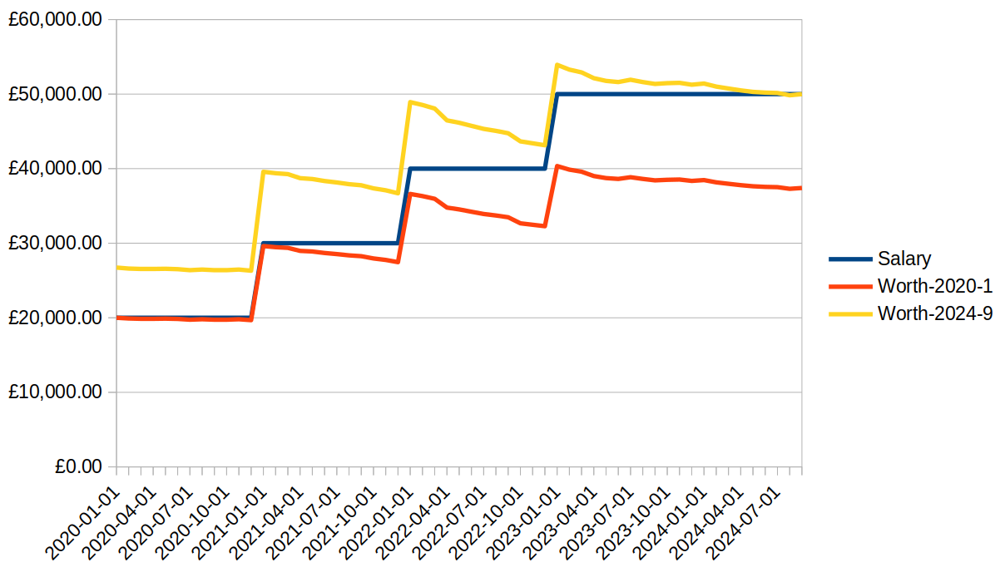

# sal

What's your historical salary worth in today's moneys?

## Info

Based on the Hargreaves Lansdown inflation calculator: https://www.hl.co.uk/tools/calculators/inflation-calculator

Uses the same ONS data source.

## Example

Suppose you have a file `salaries.json`:

```json
[
  { "year": 2020, "month": 1, "salary": 20000 },
  { "year": 2021, "month": 1, "salary": 30000 },
  { "year": 2022, "month": 1, "salary": 40000 },
  { "year": 2023, "month": 1, "salary": 50000 }
]
```

You could run this to get a csv:

```bash
cabal build
cat salaries.json | 2>/dev/null cabal run sal | jq -r '"Date,Salary,Worth", (.[] | "\(.time.year)-\(.time.month)-1,\(.salary),\(.worth)")' > result.csv
```

Plonk that into a spreadsheet and make a graph:



